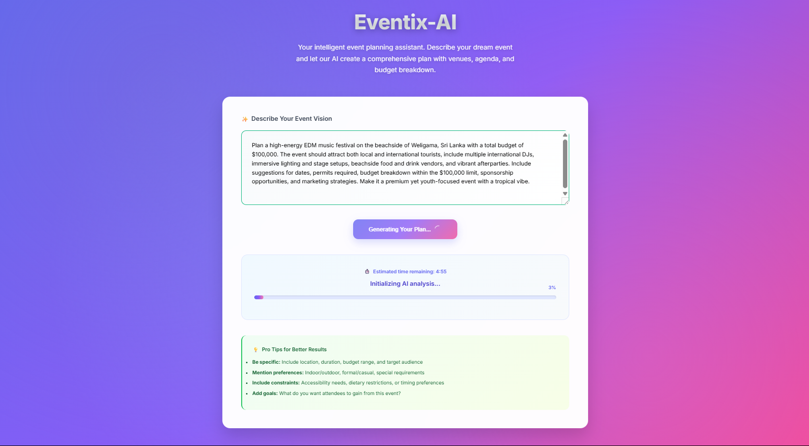

# 🧠 Eventix-AI Planner

Eventix AI planner is an autonomous multi-agent system that plans entire events from a single prompt — using LLMs, LangGraph, and real-time tools to generate agendas, budgets, and summary reports.

## 📸 Demo UI

> ⚠️ This project is a demonstration. Frontend is purposefully minimal and built with plain HTML/CSS/JS for quick testing. Entire frontend UI was generated with AI.




## ✨ Features

- 🔍 Intelligent search for venues, budget, speakers, event experts
- 📅 Agenda generation for multi-day events  
- 💰 Budget estimation for venue, catering, logistics  
- 📝 Final report generation with citations and structured summary  
- 🧠 Built using LangGraph, FastAPI, OpenAI, and Tavily

## 📦 Tech Stack

- Python 3.10+
- FastAPI
- LangGraph (for multi-agent workflow)
- OpenRouter LLM (Deepseek V3)
- Tavily (or Serper) for web search
- JsPDF (for PDF generation)

---

## 📁 Project Structure


├── api/
│ └── routes.py # API routes for event planning and PDF
├── agents/
│ ├── search_agent.py # Venue search logic
│ ├── planner_agent.py # Event agenda generation
│ ├── budget_agent.py # Budget handling
│ └── report_agent.py # Report writing
├── langgraph_flow/
│ ├── graph.py # Multi-agent flow orchestration
│ └── state.py # State definitions
├── tools/
│ ├── llm_router.py # LLM calling utilities
│ └── web_search.py # Web search utilities
├── .gitignore # Git ignore file
├── main.py # FastAPI app entry point
├── requirements.txt # Python dependencies
├── index.html # Simple frontend (vanilla JS, HTML, CSS)
└── README.md # This file

---

## 🔧 Setup Instructions

Follow these steps to get the Eventix-AI Event Planner up and running locally.

### 📁 1. Clone the Repository

```bash
git clone https://github.com/RaviyaLK/Eventix-AI-Event-Planner.git
cd eventix-ai-event-planner
```

### 🐍 2. Set Up Python Backend (FastAPI)

Create a virtual environment and activate it:

```bash
python -m venv venv
source venv/bin/activate  # On Windows: venv\Scripts\activate
```

Install the required Python packages:

```bash
pip install -r requirements.txt
```

### 🔑 3. Configure API Keys

Create a `.env` file or edit the config file to include your **OpenRouter** (or other LLM provider) API key:

```env
OPENROUTER_API_KEY=your_api_key_here
TAVILY_API_KEY=your_tavily_api_key
```

### 🚀 4. Run the FastAPI Server

Start the backend server on `http://localhost:8000`:

```bash
uvicorn main:app --reload
```

### 🌐 5. Open the Frontend

Just open `index.html` directly in your browser.
or you can open index.html using Live Server in VS code.

No build steps or installations are needed — it's pure HTML/CSS/JavaScript.

### ✅ 6. Test It!

- Enter an event description (e.g., *"Organize a tech startup conference in Colombo"*)
- Click **Generate EventPlan**
- Wait for the AI to plan the event and generate a report
- Click **Download PDF** to export the report

---

## 👨‍💻 Author

Developed by [Ravindu Wijesekara](https://github.com/RaviyaLK) — Final Year SE Undergrad | AI + Backend Enthusiast

---

## 🌟 Star this repo if you like it!
